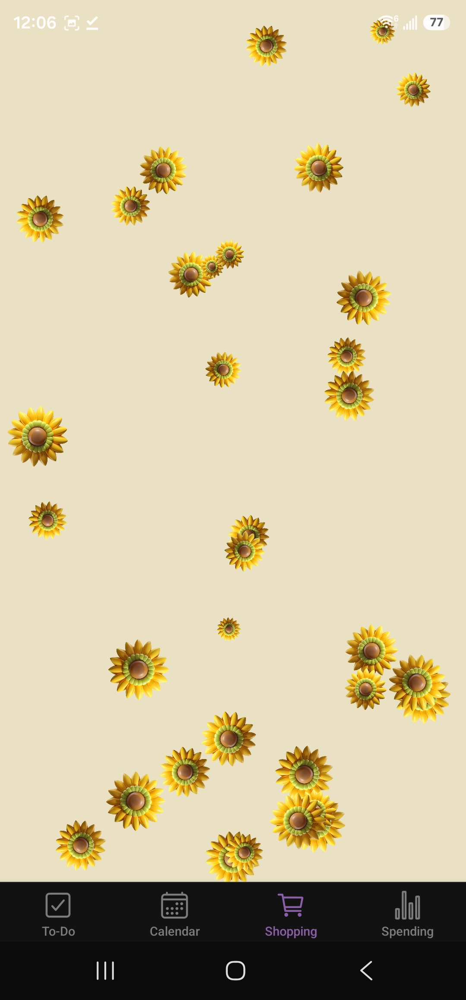
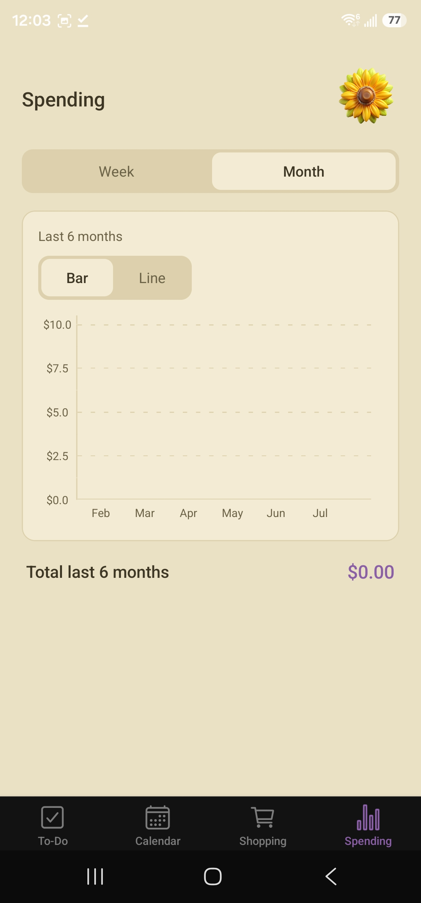
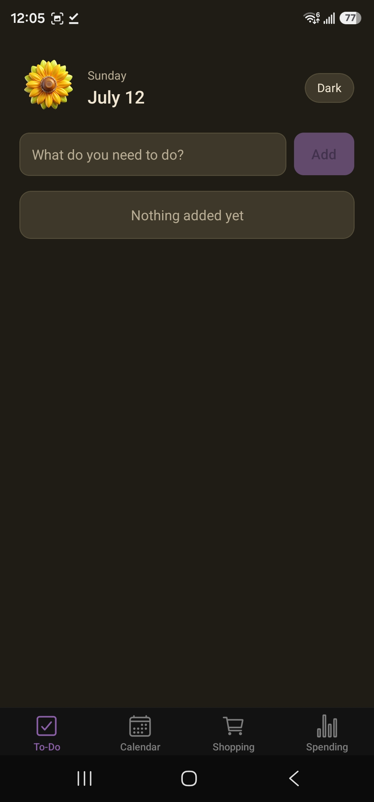
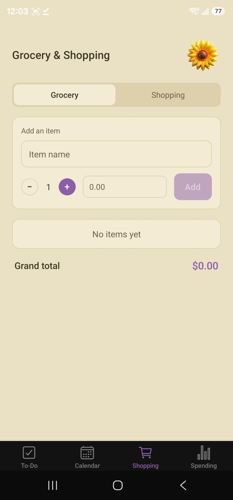
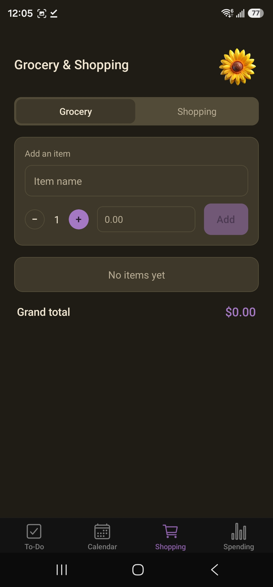
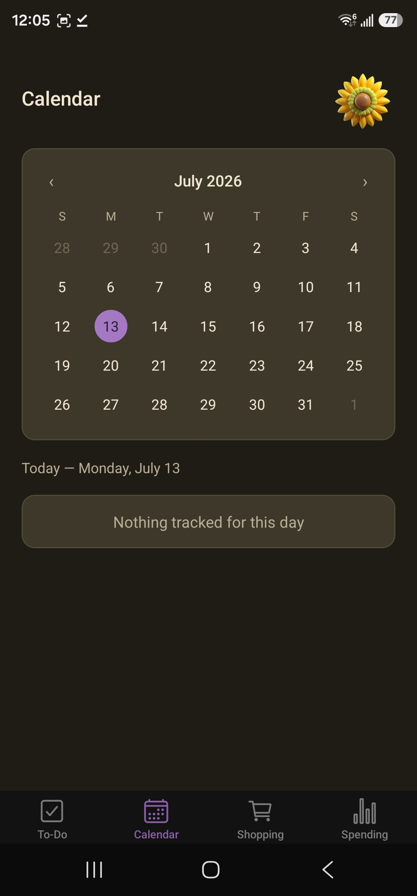
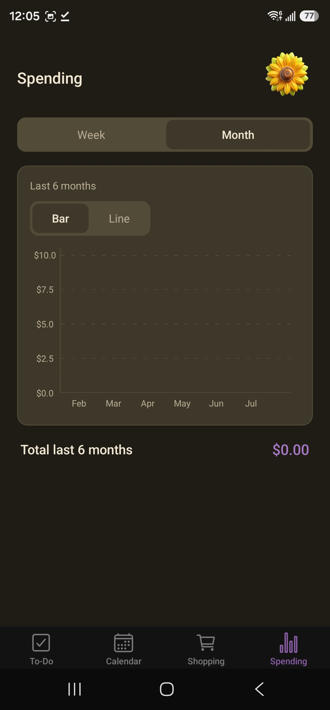
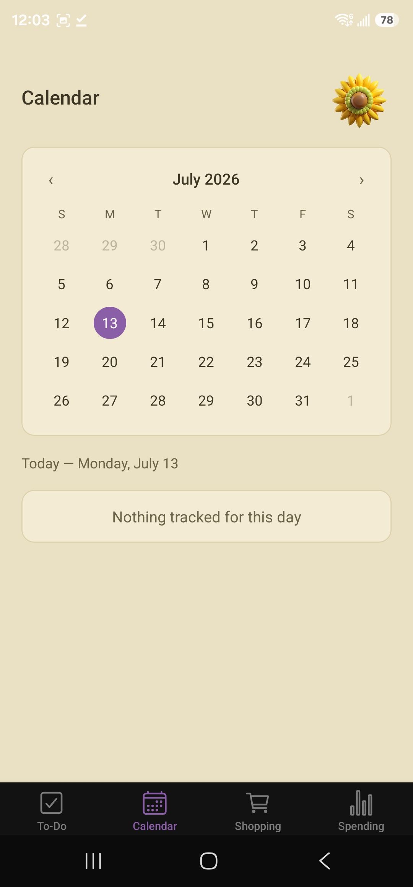
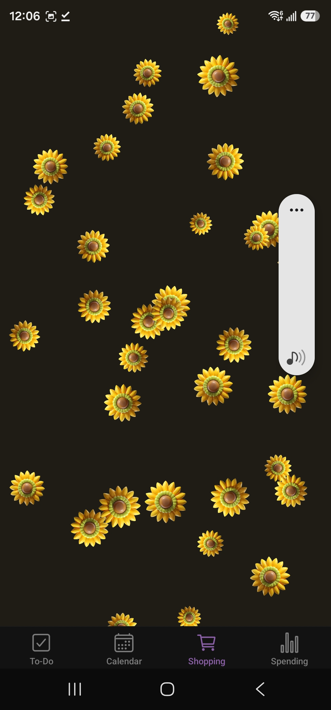
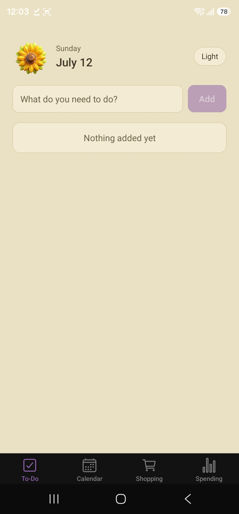

# 🌻 Bloom

A calm, focused personal organizer built for one person — daily to-dos, a history calendar, a grocery/shopping list with running totals, and a spending tracker, wrapped in a warm sunflower-themed design system called Kodama Grove.

Built with React Native, TypeScript, and Expo. Fully offline — no backend, no account, no cloud dependency.

---

## Why I built this

This app started as handwritten notes in a notebook for a specific person — someone who wanted a simple way to plan her day, track what she'd already done, manage her shopping without a spreadsheet, and see where her money was going, all in one clean, good-looking place.

Rather than reaching for a generic template, I designed a custom theme from scratch (matched to a real design reference, in both light and dark mode), built out the full data layer myself, and shipped it as an actual installable Android app — not just a demo running in a simulator. The small celebration animation on Page 1 and Page 3 (a full-screen flood of sunflowers when a list is fully completed) exists for one reason: to make finishing your to-do list feel good.

---

## Screenshots

### To-Do
| Light | Dark |
|---|---|
|  |  |

### Calendar (history view)
| Light | Dark |
|---|---|
|  |  |

### Grocery & Shopping
| Light | Dark |
|---|---|
|  |  |

### Spending
| Light | Dark |
|---|---|
|  |  |

### Completion celebration
| Light | Dark |
|---|---|
|  |  |

---

## Features

**To-Do** — A single focused daily task list. Type a task, tap Add, check it off. Nothing else on the page.

**Calendar** — A read-only history view, not a scheduler. Pick any date on the month grid and see exactly what was done (or left undone) on the To-Do list and the Grocery/Shopping list that day, pulled live from both stores.

**Grocery & Shopping** — Two separate lists (toggle between them) with per-item quantity counters, editable unit prices, auto-calculated line totals, and a running grand total. Completing an entire list triggers the celebration animation.

**Spending** — Weekly and monthly spending trends aggregated from the shopping data, with a toggle between bar and line chart views.

**Design system** — A full light/dark theme (in-app toggle, independent of system settings) built on a warm cream/olive palette with a single deliberate accent color reserved strictly for interactive elements.

**Notifications** — Three daily local reminders (morning, afternoon, evening) to check in on the to-do list.

---

## Tech stack

| Layer | Choice |
|---|---|
| Language | TypeScript |
| Framework | React Native (Expo, Expo Router) |
| State management | Zustand |
| Persistence | AsyncStorage (via Zustand's `persist` middleware) — no database, no backend |
| Styling | Custom theme system (StyleSheet + design tokens), no CSS framework |
| Animation | React Native Reanimated |
| Charts | react-native-gifted-charts |
| Icons | @expo/vector-icons (Ionicons) |
| Notifications | expo-notifications |
| Build | EAS Build (Expo Application Services) |

No backend server, no database engine, no cloud service. Everything a single user needs, running entirely on-device.

---

## Architecture

```
app/(tabs)/          → Screens (Expo Router file-based routing)
src/components/ui/   → Reusable UI primitives (Button, Input, Card, Checkbox, Counter...)
src/store/           → Zustand stores, one per data domain (todo, shopping, calendar, theme)
src/styles/          → Theme tokens and ThemeProvider
src/utils/           → Notification scheduling
```

Each store manages its own persistence independently — there's no shared database or ORM layer. The Calendar page is the one place that reads from two stores at once, joining To-Do and Shopping data by date to build its history view.

---

## Getting started

```bash
git clone <this-repo>
cd bloom
npm install
npx expo start
```

Scan the QR code with Expo Go (Android/iOS) to run it on a physical device, or press `a` / `i` for an emulator.

### Building a production APK

```bash
npm install -g eas-cli
eas login
eas build --platform android --profile preview
```

---

## License

Personal project, built for personal use. Feel free to fork it for your own version.
